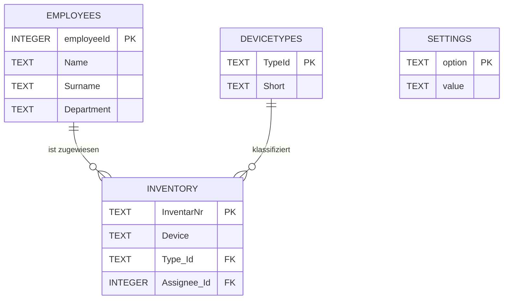
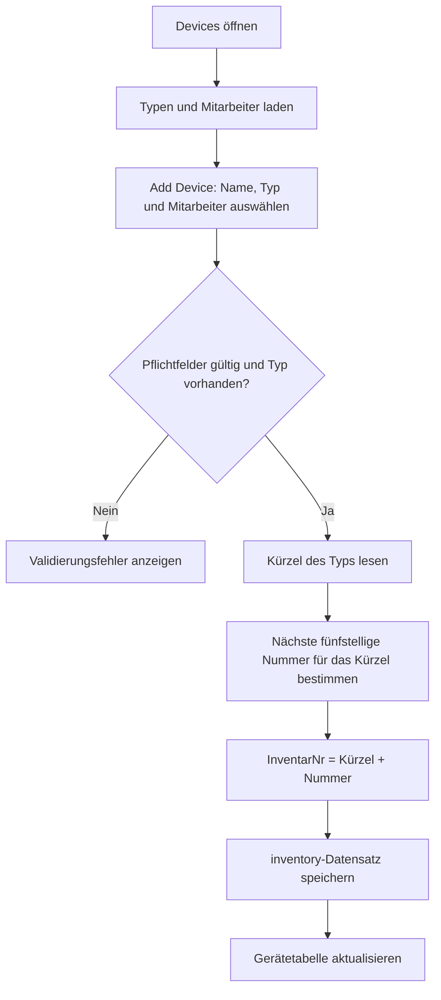
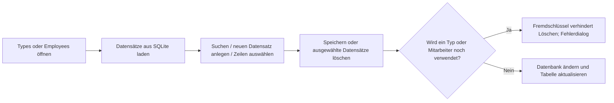
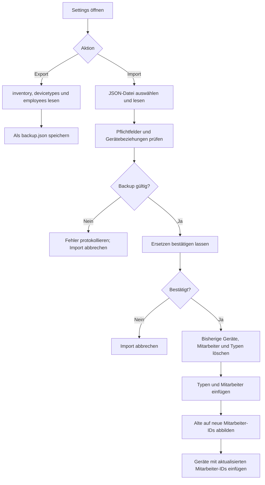

# KeepIt

KeepIt ist eine kleine Inventar-Anwendung. Mit ihr können Geräte gespeichert,
angezeigt, gesucht und wieder gelöscht werden. Die Oberfläche wird mit
[Flet](https://flet.dev/) gebaut, die Daten werden in einer lokalen SQLite-Datei
gespeichert.

## Übersicht

1. [Verwendung](#die-anwendung-benutzen)
   - [Anwendung herunterladen](#anwendung-herunterladen)
   - [Kurze Anleitung](#kurze-anleitung)
2. [Entwicklungsumgebung](#entwicklungsumgebung)
   - [Umgebung erstellen](#umgebung-erstellen)
   - [Anwendung starten](#anwendung-starten)
   - [Datenbank zurücksetzen](#datenbank-zurücksetzen)
   - [App kompilieren](#app-kompilieren)
3. [Verwendung von KI](#verwendung-von-ki)
5. [Anforderungen an das Projekt](#anforderungen)
6. [UI Entwurf](#ui-entwurf)
7. [ER Diagramm](#erdiagramm)
8. [Programmablauf](#programmablauf)
   - [Gerät anlegen](#gerät-anlegen)
   - [Typen und Mitarbeiter verwalten](#typen-und-mitarbeiter-verwalten)
   - [Backup und Wiederherstellung](#backup-und-wiederherstellung)
9. [Dokumentation](#link-zur-Dokumentation)
10. [Reflexion](#reflexion)

## Die Anwendung benutzen

### Anwendung herunterladen

https://github.com/EnteSuesssauer15/Codename-Winton-Thunder/releases

### Kurze Anleitung

- Beim ersten Start gibt es drei Beispieltypen, aber noch keine Mitarbeiter oder Geräte.
- Lege zuerst unter `Employees` einen Mitarbeiter und unter `Types` einen Typ mit Kürzel an.
- Unter `Devices` kannst du ein Gerät erfassen und Typ sowie Mitarbeiter auswählen. Die Inventarnummer wird automatisch erstellt.
- Das Dashboard zeigt die Anzahl der Geräte, Mitarbeiter und Typen.
- Unter `Settings` kannst du Geräte, Typen und Mitarbeiter als JSON sichern oder daraus wiederherstellen. Beim Import werden diese Daten ersetzt. „Save Settings“ speichert derzeit keine Einstellungen.

## Projektdateien

```text
.
├── README.md                    Projektbeschreibung und Anleitung
├── PROJECT_FLOW.md              Ablaufdiagramme und Projektübersicht
├── dev_setup.py                 Erstellt .venv und installiert Pakete
├── pyproject.toml               Projekt- und Flet-Konfiguration
├── requirements.txt             Benötigte Python-Pakete
├── src/
│   ├── main.py                  Start, Datenbankinitialisierung und Navigation
│   ├── scripts/
│   │   └── database.py          SQLite-Schema, Abfragen und Datenbankfunktionen
│   ├── views/
│   │   ├── dashboard.py         Kennzahlen und Geräteverteilung nach Typ
│   │   ├── device.py            Inventarliste, Suche und Geräteverwaltung
│   │   ├── employee.py          Mitarbeiterverwaltung
│   │   ├── settings.py          JSON-Backup und -Restore
│   │   └── type.py              Gerätetypenverwaltung
│   └── assets/                  Logos, Icons und Splash-Grafik
└── tests/
    └── test_main.py             Flet-Beispieltest, noch kein Inventartest
```

## Entwicklungsumgebung

### Umgebung erstellen

1. Öffne ein Terminal im Hauptordner des Projekts. Das ist der Ordner, in dem
	`README.md` und `dev_setup.py` liegen.
2. Führe das Einrichtungs-Skript aus:

	```bash
	python3 dev_setup.py
	```

Das Skript erstellt den Ordner `.venv` und installiert dort die benötigten
Pakete. 

### Anwendung starten

Die Befehle müssen im Hauptordner des Projekts ausgeführt werden.

Als Desktop-Anwendung:

```bash
flet run
```

Als Web-Anwendung im Browser:

```bash
flet run --web
```

### Datenbank zurücksetzen

Wenn du für einen frischen Test alle Inventardaten löschen möchtest, beende
die Anwendung und entferne `database.db`. Beim nächsten Start wird die Datei
mit leeren Tabellen neu erstellt.

Linux und macOS:

```bash
rm .flet/storage/data/database.db
```

Windows PowerShell:

```powershell
Remove-Item .flet\storage\data\database.db
```

## App kompilieren

Die folgenden Befehle erzeugen ein Paket für die jeweilige Plattform. Für
mobile Plattformen können zusätzliche SDKs und Signatur-Schlüssel notwendig
sein.

```bash
flet build apk -v      # Android
flet build ipa -v      # iOS
flet build macos -v    # macOS
flet build linux -v    # Linux
flet build windows -v  # Windows
flet build web -v      # Web
```

Weitere Informationen stehen in der [Flet-Dokumentation](https://flet.dev/docs/).

## Verwendung von KI

KI wurde meist als hilfestellung für syntax verwendet, sprich copilot autocomplete oder beispiele gegeben wie mit der GUI programmiert wird es aber selbst implementiert.
Im grunde hat die KI mir geholfen zu verstehen wie Die Bibliothek funktioniert, bei der im vergleich die offizielle Dokumentation mir nicht weitergeholfen hat.

In der `dashboard.py` und `settings.py` wurde fast ausschließlich von KI geschrieben und selbst kommentiert, aufgrund der komplexität des Importierens und Exportierens samt öffnen einer Dateiauswahl ging das auf dem weg wesentlich schneller und möglicherweise auch übersichtlicher als selbst geschrieben.

## UI-Entwurf

[Excalidraw](https://excalidraw.com/#room=076266f0ae80d05fa866,UH7-gWjAp0Z2MI0mYbicHw)

## ER Diagramm



`SETTINGS` wird beim Erstellen der Datenbank angelegt. Die Backup-Funktionen exportieren/importieren diese Tabelle derzeit nicht.

## Programmablauf

### Gerät anlegen



Beim Anzeigen der Geräteliste verbindet die App `inventory` mit `employees`, damit Name und Nachname des zugewiesenen Mitarbeiters erscheinen. Die Suche berücksichtigt Inventarnummer, Gerät, Typ, Mitarbeiter-ID und Namen.

### Typen und Mitarbeiter verwalten



### Backup und Wiederherstellung



## Link zur Dokumentation

[KeepIt Dokumentation](https://docs.google.com/document/d/1DGke-Ds1Lg0tazXipkGuDV4cOVIw2nPy0Qg5TGpkDDk/edit?usp=sharing)

## Reflexion


